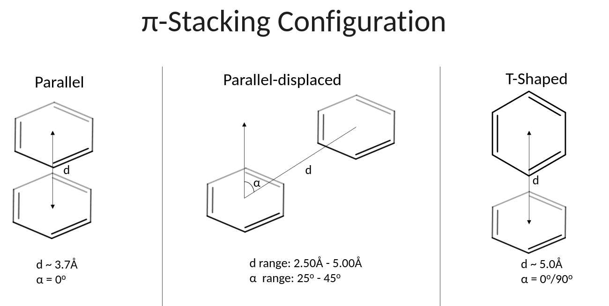
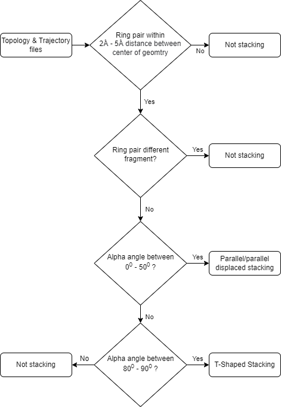
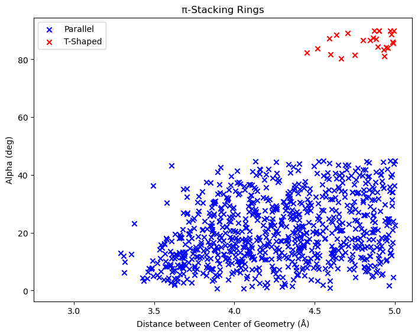
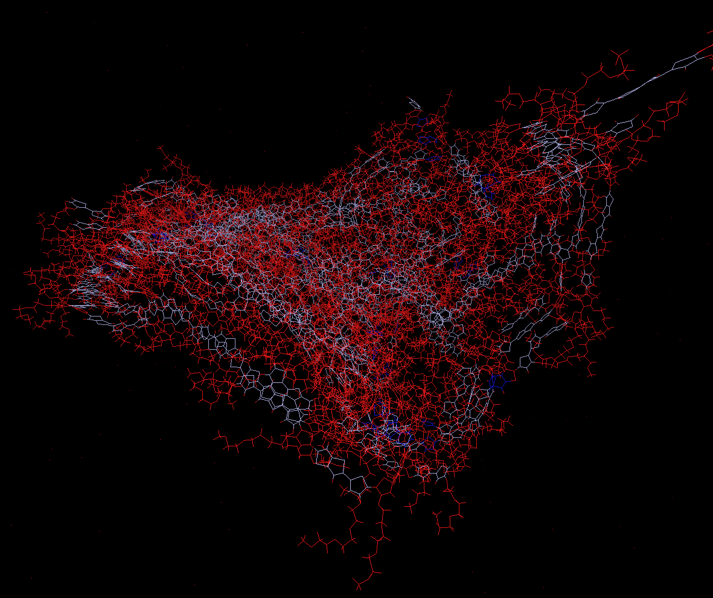

armadillo
==============================
[//]: # (Badges)

| **Latest release** | [](https://github.com/TristanSJones/armadillo/releases)   [](https://armadillo.readthedocs.io/en/latest/?badge=latest)|
| :------ | :------- |
| **Status** | [](https://github.com/TristanSJones/armadillo/actions?query=branch%3Amain+workflow%3Agh-ci) [](https://codecov.io/gh/TristanSJones/armadillo/branch/main) [](https://lgtm.com/projects/g/TristanSJones/armadillo/context:python) |
| **Community** | [](https://www.gnu.org/licenses/gpl-3.0)  [![Powered by MDAnalysis](https://img.shields.io/badge/powered%20by-MDAnalysis-orange.svg?logoWidth=16&logo=data:image/x-icon;base64,AAABAAEAEBAAAAEAIAAoBAAAFgAAACgAAAAQAAAAIAAAAAEAIAAAAAAAAAAAAAAAAAAAAAAAAAAAAAAAAAAAAAAAAJD+XwCY/fEAkf3uAJf97wGT/a+HfHaoiIWE7n9/f+6Hh4fvgICAjwAAAAAAAAAAAAAAAAAAAAAAAAAAAAAAAACT/yYAlP//AJ///wCg//8JjvOchXly1oaGhv+Ghob/j4+P/39/f3IAAAAAAAAAAAAAAAAAAAAAAAAAAAAAAAAAAAAAAJH8aQCY/8wAkv2kfY+elJ6al/yVlZX7iIiI8H9/f7h/f38UAAAAAAAAAAAAAAAAAAAAAAAAAAB/f38egYF/noqAebF8gYaagnx3oFpUUtZpaWr/WFhY8zo6OmT///8BAAAAAAAAAAAAAAAAAAAAAAAAAAAAAAAAgICAn46Ojv+Hh4b/jouJ/4iGhfcAAADnAAAA/wAAAP8AAADIAAAAAwCj/zIAnf2VAJD/PAAAAAAAAAAAAAAAAICAgNGHh4f/gICA/4SEhP+Xl5f/AwMD/wAAAP8AAAD/AAAA/wAAAB8Aov9/ALr//wCS/Z0AAAAAAAAAAAAAAACBgYGOjo6O/4mJif+Pj4//iYmJ/wAAAOAAAAD+AAAA/wAAAP8AAABhAP7+FgCi/38Axf4fAAAAAAAAAAAAAAAAiIiID4GBgYKCgoKogoB+fYSEgZhgYGDZXl5e/m9vb/9ISEjpEBAQxw8AAFQAAAAAAAAANQAAADcAAAAAAAAAAAAAAAAAAAAAAAAAAAAAAAAAAAAAjo6Mb5iYmP+cnJz/jY2N95CQkO4pKSn/AAAA7gAAAP0AAAD7AAAAhgAAAAEAAAAAAAAAAACL/gsAkv2uAJX/QQAAAAB9fX3egoKC/4CAgP+NjY3/c3Nz+wAAAP8AAAD/AAAA/wAAAPUAAAAcAAAAAAAAAAAAnP4NAJL9rgCR/0YAAAAAfX19w4ODg/98fHz/i4uL/4qKivwAAAD/AAAA/wAAAP8AAAD1AAAAGwAAAAAAAAAAAAAAAAAAAAAAAAAAAAAAALGxsVyqqqr/mpqa/6mpqf9KSUn/AAAA5QAAAPkAAAD5AAAAhQAAAAEAAAAAAAAAAAAAAAAAAAAAAAAAAAAAADkUFBSuZ2dn/3V1df8uLi7bAAAATgBGfyQAAAA2AAAAMwAAAAAAAAAAAAAAAAAAAAAAAAAAAAAAAAAAAB0AAADoAAAA/wAAAP8AAAD/AAAAWgC3/2AAnv3eAJ/+dgAAAAAAAAAAAAAAAAAAAAAAAAAAAAAAAAAAAAAAAAA9AAAA/wAAAP8AAAD/AAAA/wAKDzEAnP3WAKn//wCS/OgAf/8MAAAAAAAAAAAAAAAAAAAAAAAAAAAAAAAAAAAAIQAAANwAAADtAAAA7QAAAMAAABUMAJn9gwCe/e0Aj/2LAP//AQAAAAAAAAAA)](https://www.mdanalysis.org)|

pi stacking project

armadillo is bound by a [Code of Conduct](https://github.com/TristanSJones/armadillo/blob/main/CODE_OF_CONDUCT.md).

### Installation

To build armadillo from source,
we highly recommend using virtual environments.
If possible, we strongly recommend that you use
[Anaconda](https://docs.conda.io/en/latest/) as your package manager.
Below we provide instructions both for `conda` and
for `pip`.

#### With conda

Ensure that you have [conda](https://docs.conda.io/projects/conda/en/latest/user-guide/install/index.html) installed.

Create a virtual environment and activate it:

```
conda create --name armadillo
conda activate armadillo
```

Install the development and documentation dependencies:

```
conda env update --name armadillo --file devtools/conda-envs/test_env.yaml
conda env update --name armadillo --file docs/requirements.yaml
```

Build this package from source:

```
pip install -e .
```

If you want to update your dependencies (which can be risky!), run:

```
conda update --all
```

And when you are finished, you can exit the virtual environment with:

```
conda deactivate
```

#### With pip

To build the package from source, run:

```
pip install -e .
```

If you want to create a development environment, install
the dependencies required for tests and docs with:

```
pip install -e ".[test,doc]"
```

# Pi-Stacking Definition



# Workflow


<<<<<<< HEAD

### Test File Example

# Example armadillo Pi-Stacking Run Through

Import armadillo and MDanalysis


```
import armadillo
import MDAnalysis as mda
```

Loading universe


```
u = mda.Universe('g2T-TT_aw_KF.prmtop', 'g2T-TT_aw_KF_05_prod.nc')
```

Atomgroup containing atoms that make up rings


```
ag = sum(u.atoms.fragments[:20])
```

Calling the function to find all the rings


```
ring_list = armadillo.find_all_rings(ag, u)
```

Looping over the trajectory to produce all the pi-stacking rings


```
pi_parallel_stacking=[]
pi_t_shaped = []
for ts in u.trajectory[:25:5]:
    parallel_stacking, t_shaped = armadillo.find_pi_stacking_rings(ring_list, ag)

    pi_parallel_stacking.append(parallel_stacking)
    pi_t_shaped.append(t_shaped)
```

Plotting distrubution of pi-stacking rings


```
armadillo.pi_stacking_distribution(pi_parallel_stacking[4], pi_t_shaped[4], ring_list, ag, u, frame=20)
```





Stacked rings can be given tempfactors to be visualized in VMD

First flatten parrallel and t-shaped


```
flat_parallel_pi_stacking = list(armadillo.itertools.chain.from_iterable(pi_parallel_stacking[4]))
flat_t_shaped_pi_stacking = list(armadillo.itertools.chain.from_iterable(pi_t_shaped[4]))
```

Create atomgroups for the two lists


```
pi_ag = sum([ring_list[ix] for ix in flat_parallel_pi_stacking])
t_ag = sum([ring_list[ix] for ix in flat_t_shaped_pi_stacking])
```

Add tempfactors to the universe


```python
u.add_TopologyAttr('tempfactors')
```

Assign tempfactors to stacking rings


```python
pi_ag.tempfactors=2
t_ag.tempfactors=3
```

Write pdb file with these tempfactors and visulise in VMD using beta colouring


```python
u.atoms.write('beta_example.pdb')
```
```
Red - None Stacking
Light Blue - Parallel/Parallel Displaced Stacking
Dark Blue - T-Shaped Stacking
```



```python

```

### Copyright

The armadillo source code is hosted at https://github.com/TristanSJones/armadillo
and is available under the GNU General Public License, version 3 (see the file [LICENSE](https://github.com/TristanSJones/armadillo/blob/main/LICENSE)).

Copyright (c) 2022, Tristan Stephens-Jones


#### Acknowledgements

Project based on the
[MDAnalysis Cookiecutter](https://github.com/MDAnalysis/cookiecutter-mda) version 0.1.
Please cite [MDAnalysis](https://github.com/MDAnalysis/mdanalysis#citation) when using armadillo in published work.
